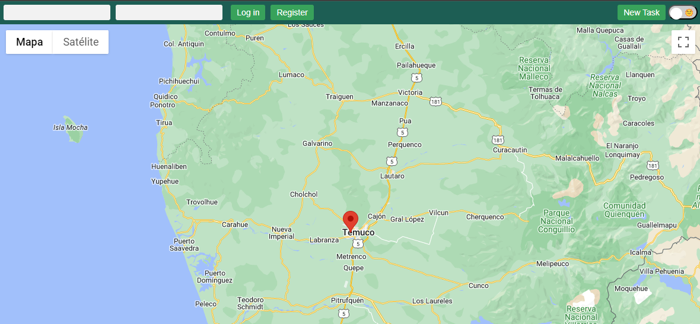

# Front-End of "mapApp" using "Model View Controler" with Vanila JS

## Instalations and configurations:

- npm install
- marker clusterer on index.html

## Other configurations

- API google maps. Used with key
- Documentation: 🔗https://developers.google.com/maps/documentation/javascript
- Coordenates 🔗https://developers.google.com/maps/documentation/javascript/geolocation#maps_map_geolocation-javascript

## Comments

- parcel & sass not working yet due that it was not loading the map from Google. Once changed to regular css (style.css) the map loaded.

- working icons from: https://www.flaticon.es/ . Use the url of each.

## Pendings & Fixes

- App not loading the map at first. It needs to be reloaded. (this needs to be solved).
- Make a marker stacker with a menu to see every event on the same or similar area.
- Not allow the display of creating event if not logged in.
- Incorportate an API which check if used email is valid.
- Check CSS for formating input fields.
- Keep logged user name when site is reloaded
